<!--
  README do perfil · Guilherme Alves
  Projetos reais, skills reais. Sem inflar.
-->

  

 

# Guilherme Alves

<<<<<<< HEAD
> Estudante iniciante de cibersegurança — sem experiência profissional e sem
> certificações ainda.
=======
> cybersecurity & automation · estudando os fundamentos de baixo nível (C, memória, binários)
> enquanto construo ferramentas reais em Python.

>>>>>>> 293fe77 (Feat: update)
---

## `// o que eu faço`

Automação de segurança, análise de binários e ferramentas defensivas.
Aprendo na prática — se funciona e resolve um problema, vale mais que qualquer certificado.

---

## `// projetos`

### Sentinel — Firewall e detector de intrusões
Sistema defensivo com logging de alertas em JSON, blacklist de IPs
e análise de portas perigosas. Código 100% escrito por mim.

`Python` · `JSON` · `OOP` · `automação`

---

## `// ferramentas`

**Linguagens**

**Infra & Segurança**

---

## `// trilha`

| Fase | Tópicos | Status |
|---|---|---|
| Python | automação, OOP, APIs, bibliotecas de segurança | **intermediário** |
| C | ponteiros, memória, buffers, bitwise | **em andamento** |
| Matemática | entropia, álgebra linear, probabilidade, cálculo aplicado | **em andamento** |
| Fundamentos | bits, inteiros, endianness, ASCII/UTF-8, IEEE 754 | concluído |
| Baixo nível | arquitetura de computador, assembly, debuggers | planejado |
| Cybersecurity | redes, web security, blue team/SIEM, DFIR, CTF | planejado |

---

## `// contato`

- **GitHub:** <https://github.com/Guilherme137alves77>
- **LinkedIn:** <https://www.linkedin.com/in/guilherme-alves-3715a3362>
- **E-mail:** <guilheme18gs.gui@gmail.com>

---

> Constância antes de hype.
