<!--
  GitHub Profile · Guilherme Alves
  Professional · minimal
-->

  

---

## `// resumo`

Estudante de Sistemas de Informação, em transição de carreira para tecnologia.

Foco atual: **QA Automation** — testar software com método e, aos poucos, com do mindset de segurança.

---

## `// tecnologias`

  

Python · Linux · Java · Automação

---

## `// contato`

- GitHub: [Guilherme137alves77](https://github.com/Guilherme137alves77)
- LinkedIn: [Guilherme Alves](https://www.linkedin.com/in/guilherme-alves-3715a3362)
- Portfolio: [Cyber Portfolio](https://guilherme137alves77.github.io/cyber-portfolio/)
