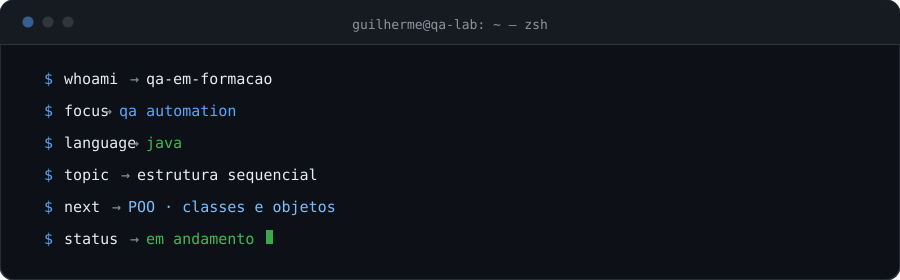
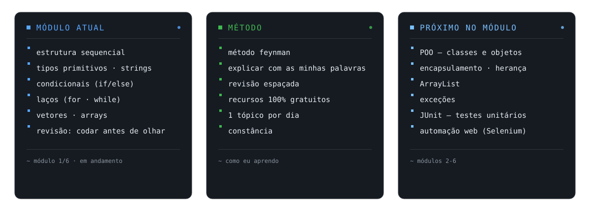
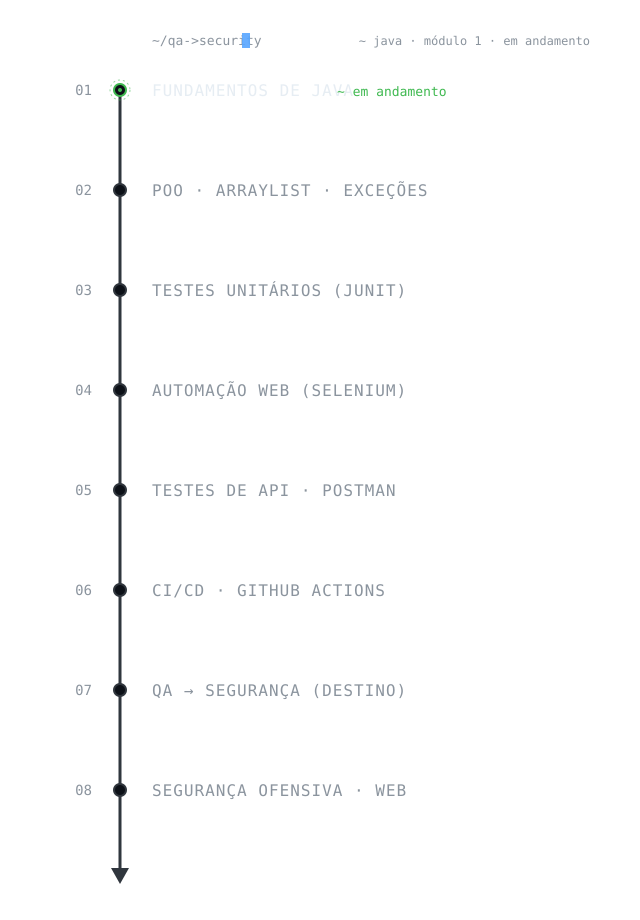
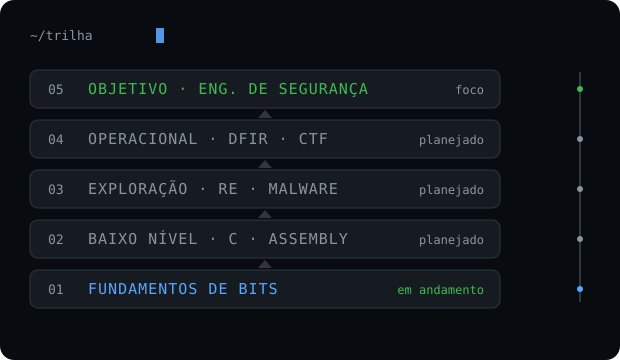
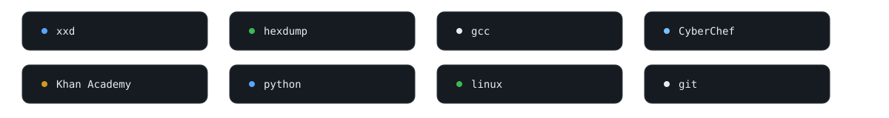

<!--
  README do perfil · Guilherme Alves
  Tom honesto: trilha em andamento (iniciante sério). Nada de inflar skills.

  AJUSTE AQUI:
  - nome e descrição no header
  - links na seção contato
  - atualize os SVGs em assets/ (terminal, learning, timeline) conforme avançar
-->

  

 

# Guilherme Alves

> Estudante iniciante de cibersegurança — sem experiência profissional e sem
> certificações ainda. Constância antes de hype: 1 tópico por dia.

---

## `// status`

  

---

## `// módulo atual`

  

---

## `// trilha de aprendizado`

| Fase | Tópicos | Status |
|---|---|---|
| Fundamentos | bits, inteiros, endianness, ASCII/UTF-8, IEEE 754, hexdump | **em andamento** |
| Baixo nível | arquitetura de computador, C, assembly x86/x64, debuggers | planejado |
| Exploração | mitigations, exploit development, reverse engineering, malware | planejado |
| Operacional | Linux red/blue, redes, web security, blue team/SIEM, DFIR, CTF | planejado |

Hoje eu estudo os fundamentos. As demais fases estão no roadmap — ainda não chegou a hora.

  

---

## `// para onde vou`

  

Objetivo: engenheiro de segurança. A base está sendo construída agora — o resto vem no seu tempo.

---

## `// ferramentas`

**Linguagens (nível iniciante — estou aprendendo)**

**Ferramentas do módulo atual**

  

---

## `// projetos`

Nenhum projeto público relevante ainda. Estou construindo meu primeiro projeto
de **análise binária / forense**. Em breve aqui.

<!-- substitua esta seção quando tiver projetos públicos -->

---

## `// contato`

<!-- preencha com seus links reais -->
- **GitHub:** <https://github.com/Guilherme137alves77>
- **LinkedIn:** <https://www.linkedin.com/in/guilherme-alves-3715a3362>
- **E-mail:** <guilheme18gs.gui@gmail.com>

---

> Sempre estudando. Sempre construindo.
