<!--
  GitHub Profile · Guilherme Alves
  Dark Technical Minimalism
-->

<p align="center">
  
</p>

---

## `// foco atual`

<p align="center">
  
</p>

---

## `// linguagens`

<p align="center">
  
</p>

---

## `// ferramentas & ambiente`

<p align="center">
  
</p>

---

## `// projetos`

Projetos com código real. **Status honesto**: o que está público, o que é
local e o que está em construção.

###  AEGIS — Security Automation Toolkit
Plataforma modular de **SOC / Blue Team** em Python: comandos de rede, sistema,
logs, web, integridade e threat intel. CLI com Typer, UI com Rich, coleta via psutil.
`Python` `Typer` `Rich` `psutil` — `● ativo (local, em breve público)`

###  sentinel-firewall
Mini **Firewall & Intrusion Detection System**: análise de conexões,
blacklist de IPs e logging de alertas em JSON. 100% autoral.
`Python` `OOP` `JSON` — `● público`

###  AuthGym
Sistema de **controle de acesso para academias** com reconhecimento facial
(OpenCV + MediaPipe).
`Python` `OpenCV` `MediaPipe` — `● público`

###  Lab-Cyber
Plataforma educacional de cibersegurança com **100 desafios práticos**.
`JavaScript` — `● público`

###  Laboratório de Pentest (Docker)
Ambiente **isolado** (rede interna) com Kali + DVWA + Juice Shop + Metasploitable
para estudo de pentest e Burp Suite.
`Shell` `Docker` `nmap` `sqlmap` — `○ local (não publicado)`

###  Secure E-commerce Lab
Laboratório de **segurança web / backend** em Express: sessões, CSRF,
validação, rate limiting e modo de treino com vulnerabilidades (IDOR, XSS).
`Node.js` `Express` `SQLite` — `● concluído`

###  Outros
`StreetKick` (Lua/LÖVE) · `Studying-C` (fundamentos de C) · `Hyprland-cyber` (dotfiles Linux) ·
`Barber-site` (HTML/CSS/JS) · `Avaliacao` (JS) · `Cyber Portfolio` (site)

---

## `// trilha de estudos`

Dias 1–4 concluídos · estudando representação de dados:

* [x] Binário e hexadecimal
* [x] Inteiros e integer overflow
* [x] Endianness · ASCII · UTF-8
* [x] IEEE 754 e ponto flutuante (NaN, infinity)
* [ ] Assembly x86 · debugging

---

## `// filosofia`

```text
Learn → Build → Break → Understand → Document
```

Não quero só usar ferramentas — quero entender **o que acontece por baixo delas**.

---

## `// contato`

- GitHub: [Guilherme137alves77](https://github.com/Guilherme137alves77)
- LinkedIn: [Guilherme Alves](https://www.linkedin.com/in/guilherme-alves-3715a3362)
- Portfolio: [Cyber Portfolio](https://guilherme137alves77.github.io/cyber-portfolio/)

---

```text
$ whoami

guilherme@security-lab
Cybersecurity student
Developer
Linux user
Always learning.
```
